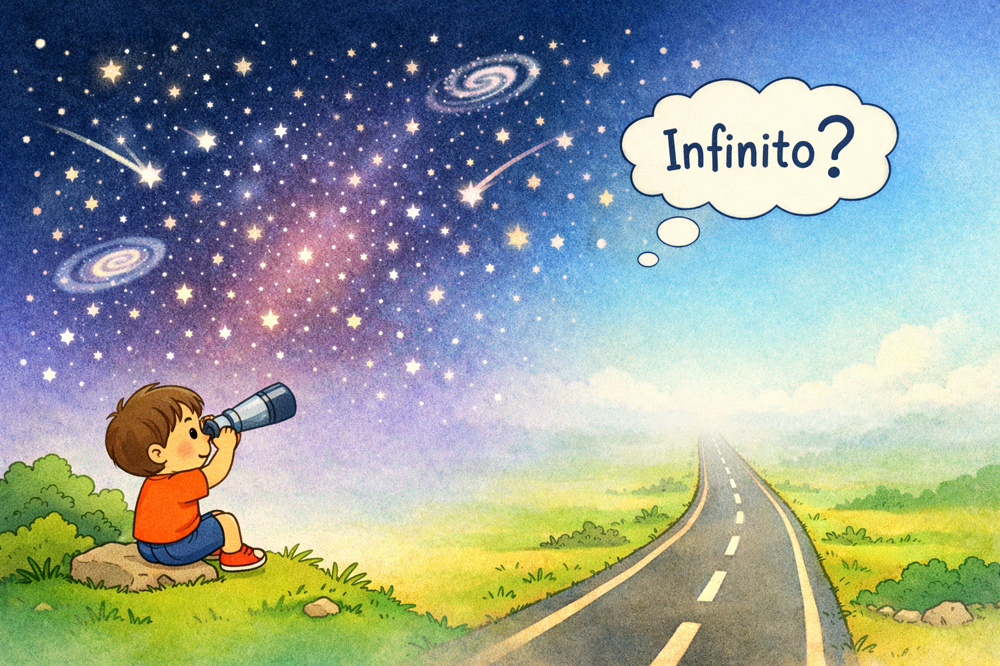

# 2. Que se deve entender por infinito?
“O que não tem começo nem fim; o desconhecido; tudo que é desconhecido é infinito.”

## Explicação para crianças

“Infinito” é uma coisa que não tem começo nem fim. É como uma estrada que você anda, anda, anda… e ela nunca acaba, nem dá para achar onde ela começou.

O livro também diz “o desconhecido”. Isso quer dizer que, quando a gente não consegue ver, medir ou entender até onde algo vai, parece que aquilo é infinito para nós. Por exemplo: quando você olha para o céu à noite, dá a sensação de que o espaço não termina nunca, porque a gente não consegue enxergar o final.

Mas atenção: “tudo que é desconhecido é infinito” não quer dizer que tudo realmente não tem fim; quer dizer que, para a nossa mente, aquilo pode parecer sem fim porque ainda não sabemos explicar ou encontrar os limites.

